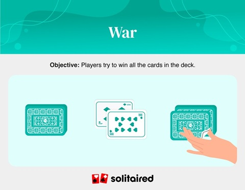

# War
   Objective: Win all 52 cards by having the highest card each draw.

What you need: A regular deck of cards

Players: 2

War objective
How to play:

Deal each player 26 cards, keeping their pile of cards facedown.

To start, each player flips over their top card into the center. The player with the higher card wins both cards and places the cards won at the bottom of their pile.

When the players play cards of the same rank, they go to “war” by drawing three more cards and playing them facedown and a final fourth card played face up. The higher of the face-up cards wins the hand and all the cards played in that round.

One player wins when they have all the cards and their opponent has none. If a player doesn’t have enough cards to play a war, they also lose the game.